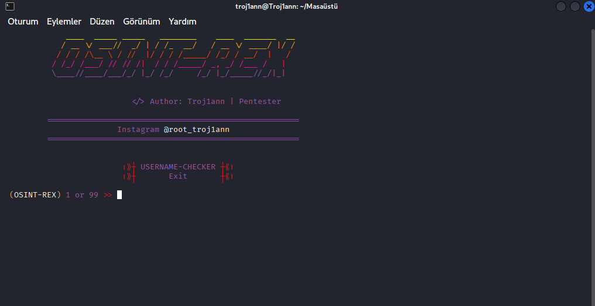
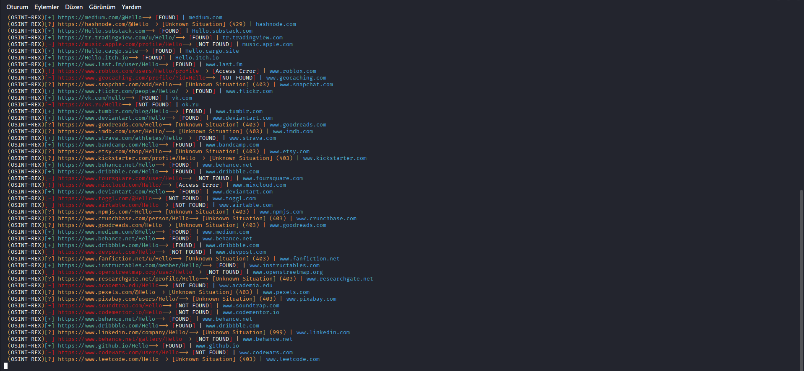

# 🦖 OSINT-REX

<div align="center">

```
                                 ____  _____ _____   ________    ____  _______  __
                                / __ \/ ___//  _/ | / /_  __/   / __ \/ ____/ |/ /
                               / / / /\__ \ / //  |/ / / /_____/ /_/ / __/  |   / 
                              / /_/ /___/ // // /|  / / /_____/ _, _/ /___ /   |  
                              \____//____/___/_/ |_/ /_/     /_/ |_/_____//_/|_|  
```

**Advanced Username OSINT Framework**


*Hunt usernames across 110+ social media platforms and websites*

[English](#english) | [Türkçe](#türkçe)

</div>

---

## 🇬🇧 ENGLISH

### 📖 Description

**OSINT-REX** is a powerful username reconnaissance tool designed for penetration testers, security researchers, and OSINT investigators. It checks username availability across 110+ platforms including social media, developer communities, gaming networks, and more.

### ✨ Features

- 🔍 **110+ Platform Support** - Instagram, Twitter, GitHub, Steam, Discord, and more
- 🎨 **Beautiful CLI Interface** - Colorful terminal output with progress tracking
- ⚡ **Fast Scanning** - Efficient HTTP requests with timeout handling
- 📊 **JSON Configuration** - Easy to add/remove platforms via `sites.json`
- 🛡️ **Error Handling** - Robust exception management for network issues
- 🎯 **Accurate Detection** - Status code validation for reliable results
- 🔄 **Cross-Platform** - Works on Linux, Windows, and MacOS

### 🎯 Use Cases

- **OSINT Investigations** - Track digital footprints across platforms
- **Penetration Testing** - Reconnaissance phase information gathering
- **Security Audits** - Verify account exposure and online presence
- **Research Projects** - Academic studies on digital identity
- **Personal Use** - Check username availability before registration

### 📦 Installation

See [INSTALLATION.md](/docs/INSTALLATION.md) for detailed setup instructions.

**Quick Install:**
```bash
git clone https://github.com/yourusername/OSINT-REX.git
cd OSINT-REX
pip install -r requirements.txt
python main.py
```

### 🚀 Usage

1. **Run the tool:**
   ```bash
   python main.py
   ```

2. **Enter a username when prompted:**
   ```
   (OSINT-REX) 1 or 99 >> 1
   (OSINT-REX)UserName> johndoe
   ```

3. **Review results:**
   - ✅ **GREEN [FOUND]** - Username exists on platform
   - ❌ **RED [NOT FOUND]** - Username not found
   - ⚠️ **YELLOW [Unknown]** - Unexpected response
   - 🔴 **RED [Access Error]** - Connection/timeout issue

### 📋 Supported Platforms

<details>
<summary>Click to expand platform list (110+ sites)</summary>

**Social Media:**
- Twitter/X, Instagram, Facebook, TikTok, Snapchat
- LinkedIn, Reddit, Pinterest, Tumblr, VK

**Developer Platforms:**
- GitHub, GitLab, Stack Overflow, Replit, CodePen
- Dev.to, Kaggle, HackerRank, LeetCode

**Gaming:**
- Steam, Discord, Twitch, Epic Games, Xbox
- Roblox, Minecraft (NameMC), Fortnite Tracker

**Creative:**
- Behance, Dribbble, DeviantArt, ArtStation
- Wattpad, Archive of Our Own, Medium

**Music:**
- Spotify, SoundCloud, Bandcamp, Last.fm
- Apple Music, Mixcloud

**Others:**
- Patreon, OnlyFans, Etsy, Kickstarter
- Quora, 9GAG, MyAnimeList, Chess.com

*Full list in [sites.json](sites.json)*
</details>

### ⚙️ Configuration

Edit `sites.json` to customize platform list:

```json
{
  "sites": [
    "https://github.com/{username}",
    "https://twitter.com/{username}",
    "https://custom-site.com/user/{username}"
  ]
}
```

**Note:** Use `{username}` as placeholder for dynamic username injection.

### 🛠️ Requirements

- Python 3.8 or higher
- Internet connection
- Terminal/Command Prompt

**Dependencies:**
- requests
- colorama
- tqdm
- pyfiglet
- termcolor
- numpy

### 📸 Screenshots





### ⚠️ Legal Disclaimer

**OSINT-REX is for educational and authorized testing purposes only.**

- ✅ Use for legitimate OSINT research
- ✅ Use with proper authorization
- ✅ Respect platform Terms of Service
- ❌ Do NOT use for harassment
- ❌ Do NOT use for stalking
- ❌ Do NOT violate privacy laws

**The author is not responsible for misuse of this tool.**

### 🤝 Contributing

Contributions are welcome! 

1. Fork the repository
2. Create feature branch (`git checkout -b feature/AmazingFeature`)
3. Commit changes (`git commit -m 'Add AmazingFeature'`)
4. Push to branch (`git push origin feature/AmazingFeature`)
5. Open a Pull Request

### 📝 License

This project is licensed under the MIT License - see [LICENSE](LICENSE) file for details.

### 👤 Author

**Troj1ann** - Penetration Tester & Security Researcher

- Instagram: [@root_troj1ann](https://instagram.com/root_troj1ann)
- GitHub: [Your GitHub Profile]

### 🙏 Acknowledgments

- Inspired by [Sherlock Project](https://github.com/sherlock-project/sherlock)
- Thanks to the OSINT community
- Built for security professionals

### 📞 Support

- Report bugs via [GitHub Issues]
- Feature requests welcome
- Security issues: Contact privately

---

## 🇹🇷 TÜRKÇE

### 📖 Açıklama

**OSINT-REX**, penetrasyon testçileri, güvenlik araştırmacıları ve OSINT dedektifleri için tasarlanmış güçlü bir kullanıcı adı keşif aracıdır. Instagram, Twitter, GitHub, Steam, Discord dahil 110+ platformda kullanıcı adı kontrolü yapar.

### ✨ Özellikler

- 🔍 **110+ Platform Desteği** - Sosyal medya, geliştirici toplulukları, oyun ağları
- 🎨 **Güzel Terminal Arayüzü** - Renkli çıktı ve ilerleme takibi
- ⚡ **Hızlı Tarama** - Optimize HTTP istekleri
- 📊 **JSON Yapılandırması** - `sites.json` ile kolay özelleştirme
- 🛡️ **Hata Yönetimi** - Ağ sorunları için güçlü koruma
- 🎯 **Doğru Tespit** - Güvenilir sonuçlar için durum kodu doğrulaması
- 🔄 **Çapraz Platform** - Linux, Windows ve MacOS desteği

### 🚀 Kullanım

1. **Aracı çalıştırın:**
   ```bash
   python main.py
   ```

2. **Kullanıcı adı girin:**
   ```
   (OSINT-REX) 1 veya 99 >> 1
   (OSINT-REX)KullaniciAdi> ahmetcan
   ```

3. **Sonuçları inceleyin:**
   - ✅ **YEŞİL [FOUND]** - Kullanıcı platformda bulundu
   - ❌ **KIRMIZI [NOT FOUND]** - Kullanıcı bulunamadı
   - ⚠️ **SARI [Unknown]** - Beklenmeyen yanıt
   - 🔴 **KIRMIZI [Access Error]** - Bağlantı hatası

### 📋 Desteklenen Platformlar

110+ platform için [sites.json](sites.json) dosyasına bakın.

### ⚙️ Yapılandırma

Platform listesini özelleştirmek için `sites.json` düzenleyin:

```json
{
  "sites": [
    "https://github.com/{username}",
    "https://ekşisözlük.com/biri/{username}"
  ]
}
```

### ⚠️ Yasal Uyarı

**OSINT-REX yalnızca eğitim ve yetkili test amaçlıdır.**

- ✅ Meşru OSINT araştırmaları için kullanın
- ✅ Uygun yetkilendirme ile kullanın
- ❌ Taciz için kullanmayın
- ❌ Gizlilik yasalarını ihlal etmeyin

**Yazar, bu aracın kötüye kullanımından sorumlu değildir.**

### 👤 Yazar

**Troj1ann** - Penetrasyon Testçisi

- Instagram: [@root_troj1ann](https://instagram.com/root_troj1ann)

### 📝 Lisans

MIT Lisansı - Detaylar için [LICENSE](LICENSE) dosyasına bakın.

---

<div align="center">

**⭐ Star this repo if you find it useful!**

Made with ❤️ by Troj1ann


</div>


